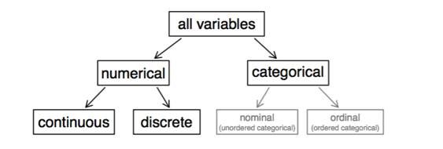

```{r}
library(dplyr)
```

```{r setup, include=FALSE}
knitr::opts_chunk$set(echo = TRUE)
```
## 统计学
统计学是一门研究如何正确收集样本数据，处理数据，并用样本做出正确推断的科学。拿料理打一个比方。总体就是一锅料理，样本就是一小勺，好的样本就是均匀搅拌过的一勺（即随机抽样），不好的样本就是未经搅拌的一勺，统计推荐就是通过一勺料理的味道来推断整锅料理的味道。所以要想做出正确的推断，必须有好的样本。

## 数据的分类


- 数据的类别

数据分为两类：数值型和非数值型。数值型数据又分为连续型和非连续型。非数值型数据分为有序的和无序的。


```{r cars}
glimpse(cars)
```

## Including Plots

You can also embed plots, for example:

```{r pressure, echo=FALSE}
plot(pressure)
```

Note that the `echo = FALSE` parameter was added to the code chunk to prevent printing of the R code that generated the plot.
